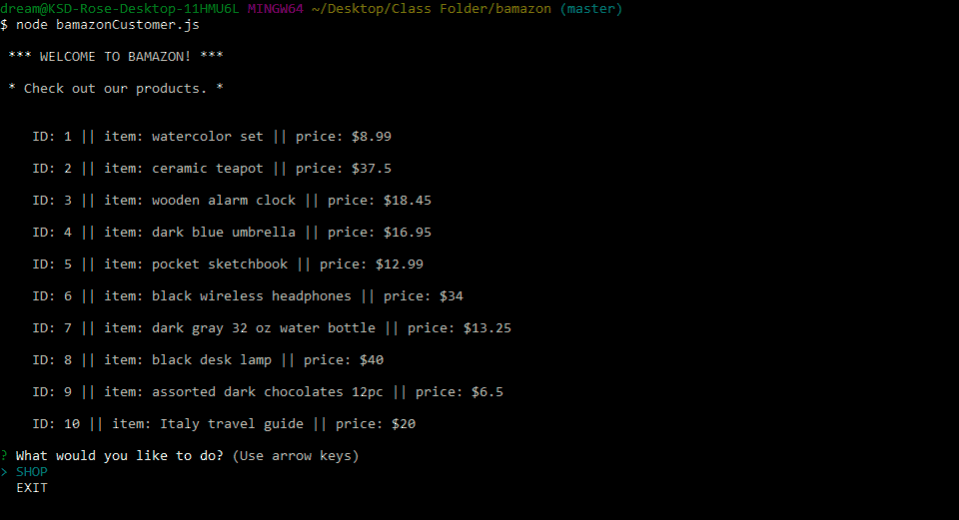

# Bamazon

## Contributors
- kd101jp14

## About
Bamazon is a CLI (Command-line Interface) application that connects to a mySQL database, which holds data for several items that the user may "purchase." The user may select the item of choice and the quantity desired. If there are enough units of the item in stock, the order is successful, and the user recieves a total for the order. Otherwise, the user will receive an "INSUFFICIENT QUANTITY" message. The database is updated, based on the user's actions.

## The Challenge
The main challenge of this project was grabbing and updating the data in the database via Javascipt code, as shown in `bamazonCustomer.js`. After several attempts to pass data form function to function, I overcame the challenge of getting the functions to run properly by understanding that the parameters could be used as objects that carried the necessary data. I also gained practice with forming appropiate queries to select the data needed from the database.

## How to run this application:
- Clone this repository to your computer.
- Install Node.js.
- Install MySQL.
- Open the repository in your CLI and enter `npm init -y`.
- Enter `npm i` to install the necessary dependencies for this app.
- Enter `node bamazonCustomer.js` to interact with the application in your CLI.
- Note: You must enter your own MySQL password in `bamazonCustomer.js` for this application to run.

## Technologies Used
- CLI (Git Bash)
- Node.js
- Javascript
- MySQL
- Inquirer.js API

## Preview

## License

This project does not have a license and is not currently open for contributions. Suggestions are welcome.

## Contact
- davis.kyra@rocketmail.com
